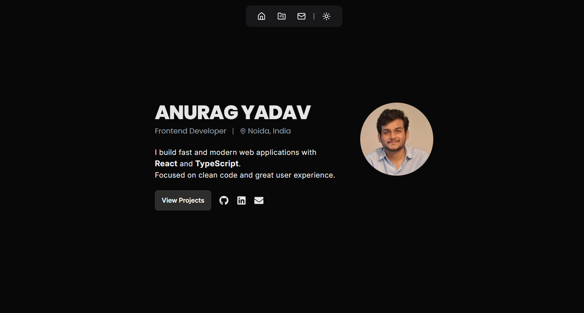

# Portfolio Website

Built with React, TypeScript, and Tailwind CSS.

## Preview



---

## ✨ Features

- Clean and modern user interface  
- Fully responsive across all screen sizes  
- Built with reusable React components  
- Light and dark mode support  
- Showcases selected projects with live links  
- Fast and optimized performance  
- Accessible and easy-to-read UI  

---

## Tech Stack

- React  
- TypeScript  
- Tailwind CSS  

---

## Installation & Setup

```bash
# Clone the project
git clone https://github.com/Anurag2516/my-portfolio

# Navigate to project folder
cd my-portfolio

# Install dependencies
npm install

# Set up environment variables
VITE_EMAILJS_SERVICE_ID=your_emailjs_service_id_here
VITE_EMAILJS_TEMPLATE_ID=your_emailjs_template_id_here
VITE_EMAILJS_PUBLIC_KEY=your_emailjs_public_key_here

# Start development server
npm run dev

```
---

## License
This project is licensed under the MIT License — see the LICENSE file for details.

